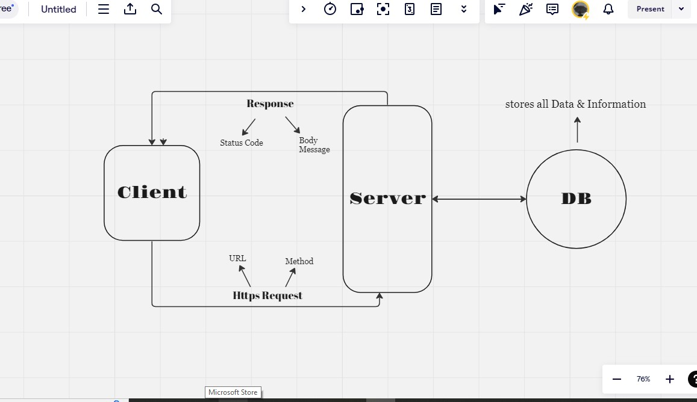

# Movies-Library 

**Author Name** : *Makarem Abu Sosain*

## WRRC

## Overview
*check the latest movies based on categories app.*

## Getting Started
*firstly I added home page function*
*then I added the favorite page*
*Also I added error Routes 500 and 404 to test it*
*as well as I added trending and search and popular and upcoming Routes*
*I create DB called movie and inside it I created table called movies*
*I connected the server and the DB togather*
*I created post request to add movie into the DB*
*I created get request to return all the data from the DB*

## Project Features
*An easy-to-use application suitable for those who love movies*